# SMT Breakout Boards

Some small adapter boards to help with prototyping SMT packages on a breadboard.

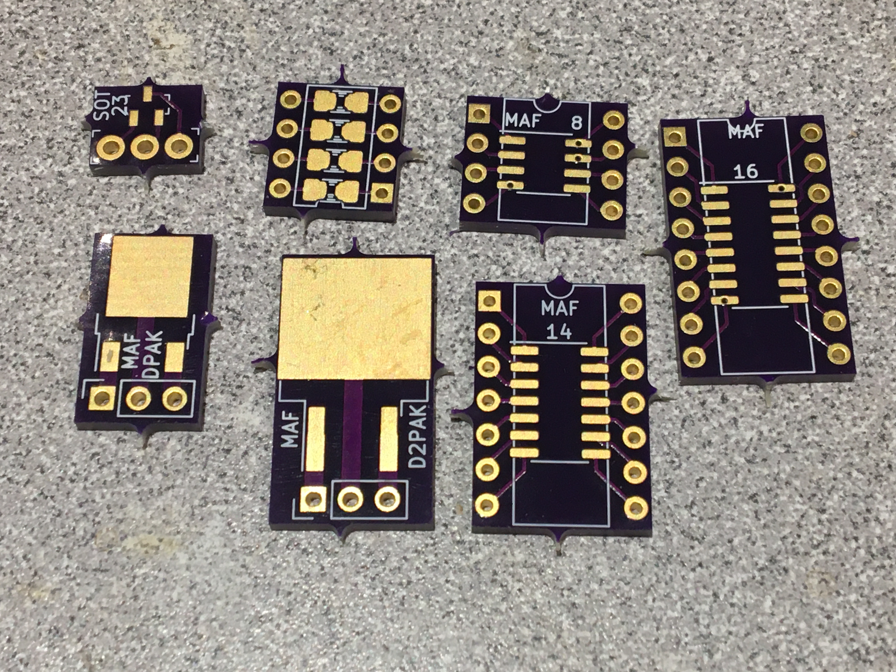

## Design

I used KiCad to draw these.

Usually you would start with a schematic and a symbol and then lay out the PCB.

In this case I just opened the PCBNew application and ad-hoc added the footprints and then drew traces to wire them up.

## Supported Packages

* [SOIC](https://en.wikipedia.org/wiki/Small_outline_integrated_circuit)
  * 8
  * 14
  * 16
* [SOT-23](https://en.wikipedia.org/wiki/Small-outline_transistor)
  * 3
  * 5
* DPAK / [TO-252](https://en.wikipedia.org/wiki/TO-252)
* D2PAK / [TO-263](https://en.wikipedia.org/wiki/TO-263)
* Discrete 0406 / 0603 / 0806 / 1204 packages in a DIP carrier footprint
  * x4
  * x7

I will add more footprints as I need them.

## Fabrication

I Used OSHPark to have these made. Mostly because I don't have a setup to make my own boards.

For convenience, I shared the uploaded board projects:

| Part | Link |
|:-----|:-----|
| SOIC-8  | https://oshpark.com/shared_projects/7HKL5QIy |
| SOIC-14 | https://oshpark.com/shared_projects/QcCbjX4y |
| SOIC-16 | https://oshpark.com/shared_projects/uA6pM7Gf |
| SOT-23  | https://oshpark.com/shared_projects/ge0wqWtr |
| SOT23-5 | https://oshpark.com/shared_projects/e4J13SY4 |
| SMD-6   | https://oshpark.com/shared_projects/h2nZ3u9U |
| TO-252 (DPAK) | https://oshpark.com/shared_projects/cjtZqxyG |
| TO-263 (D2PAK) | https://oshpark.com/shared_projects/tPH46DG8 |
| 0406/0603/0806/1204 x4 | https://oshpark.com/shared_projects/MdGxr2ob |
| 0406/0603/0806/1204 x7 | https://oshpark.com/shared_projects/SLZF8xvz |

> I am not affiliated by or sponsored by OSHPark.
> I just am really happy with the kind of service they provide.

## Assembly

These steps assume you have

* A fine point soldering iron
* Fine electronic solder - I have 22 gauge
* Solder flux.

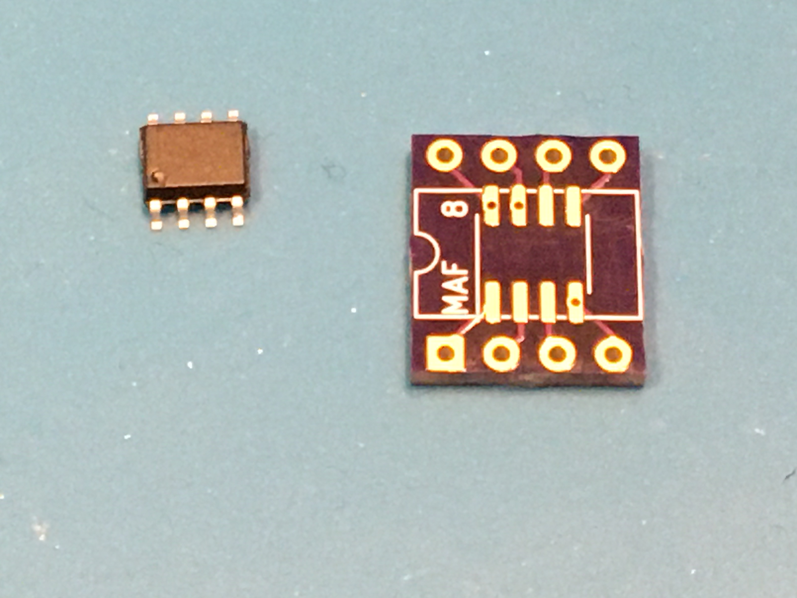

Start by soldering the SMT device to the PCB

* Use as fine of a tip of a soldering iron as you can

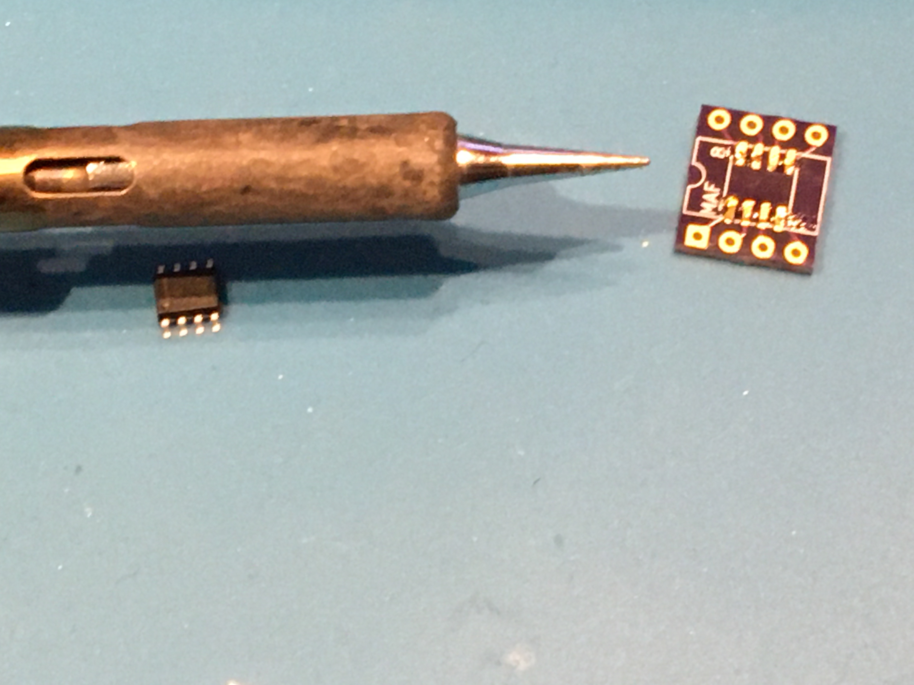

> I have a hot air solder station. I use a fine point solder iron here, as this is more likely what most people would have.

* Use a bit of solder flux across all the pads.

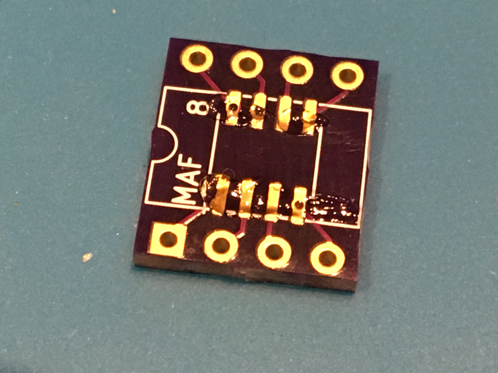

* Orient the package over the pads

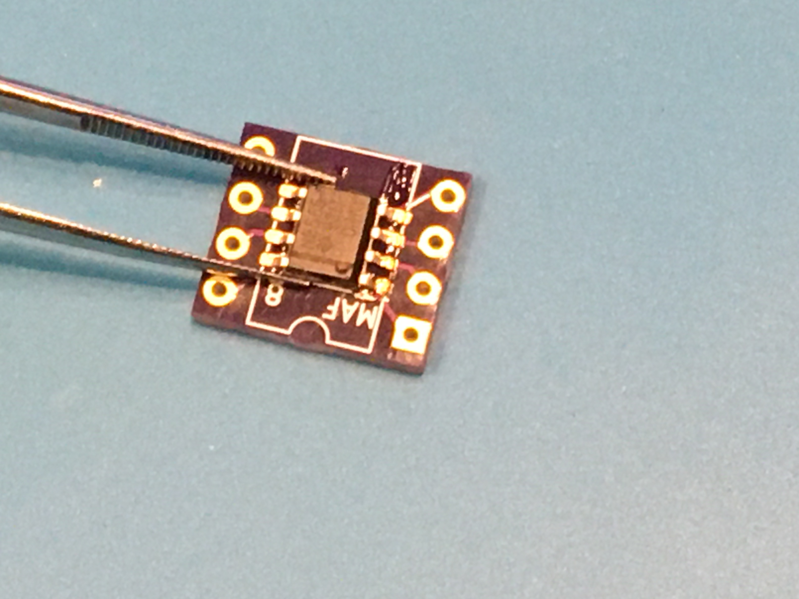

> I like to use a pair of tweezers

* Tack one of the pins with a bit of solder loosely.

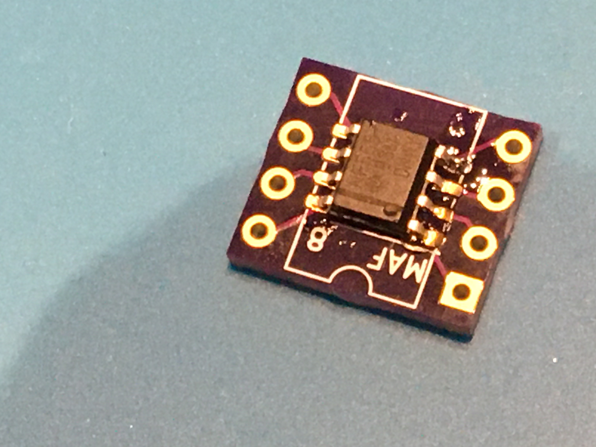

* Make sure the package is still lined up. If it is not. Reheat the pad we tacked it with, use tweezers to nudge the package until it is aligned.

> This is the hard part and takes practise.

* Drag a bit of solder across the pins

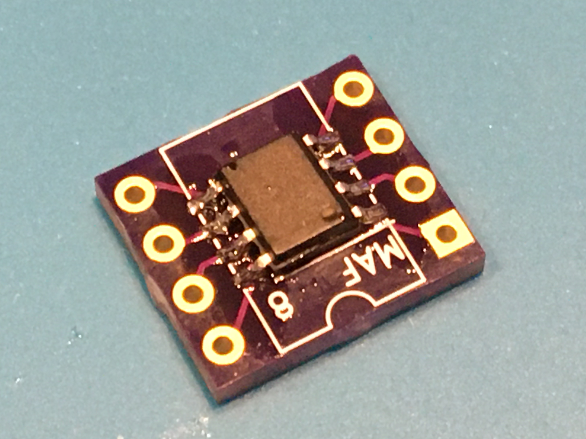

> This part is fun. The solder mask prevents the solder from sticking between the pads. The flux helps the solder to flow evenly over each pin.
> We want to use as little solder as possible here.

* Clean the extra solder flux off with a bit of rubbing alcohol and a q-tip or small sponge.

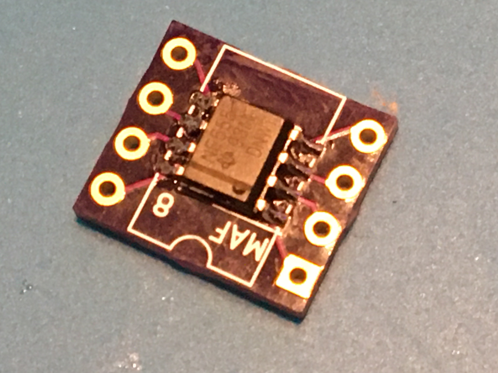

> If your device is static sensitive, work on a grounded or ESD safe surface.

* (Optional) : Where applicable, if you would like a decoupling capacitor, solder the 0603 package capacitor to the back

* Cut stock pin headers as needed.

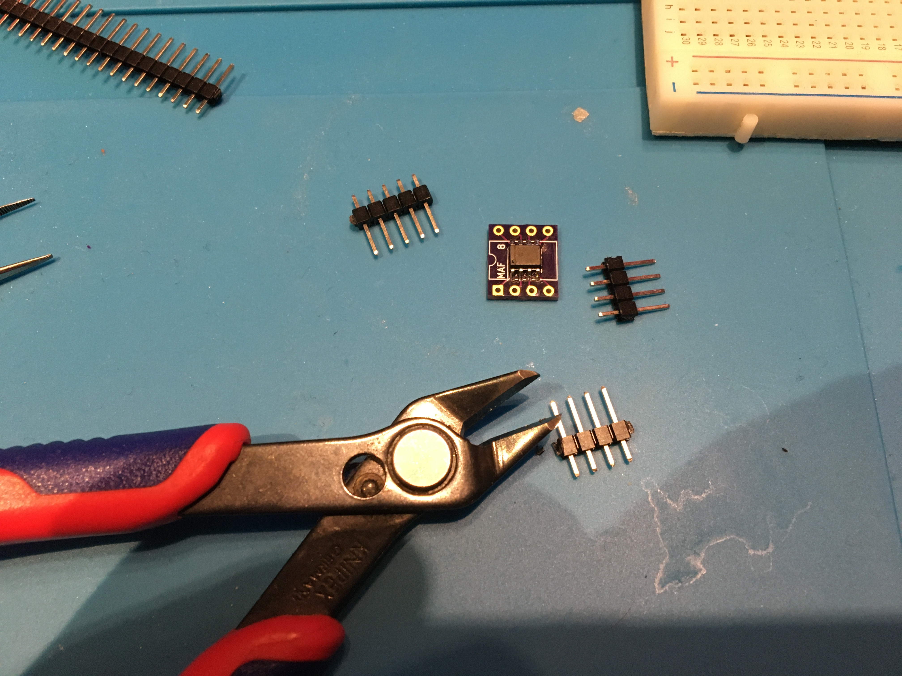

* Dry fit place the headers into the holes. Test alignment with a proto board or breadboard.

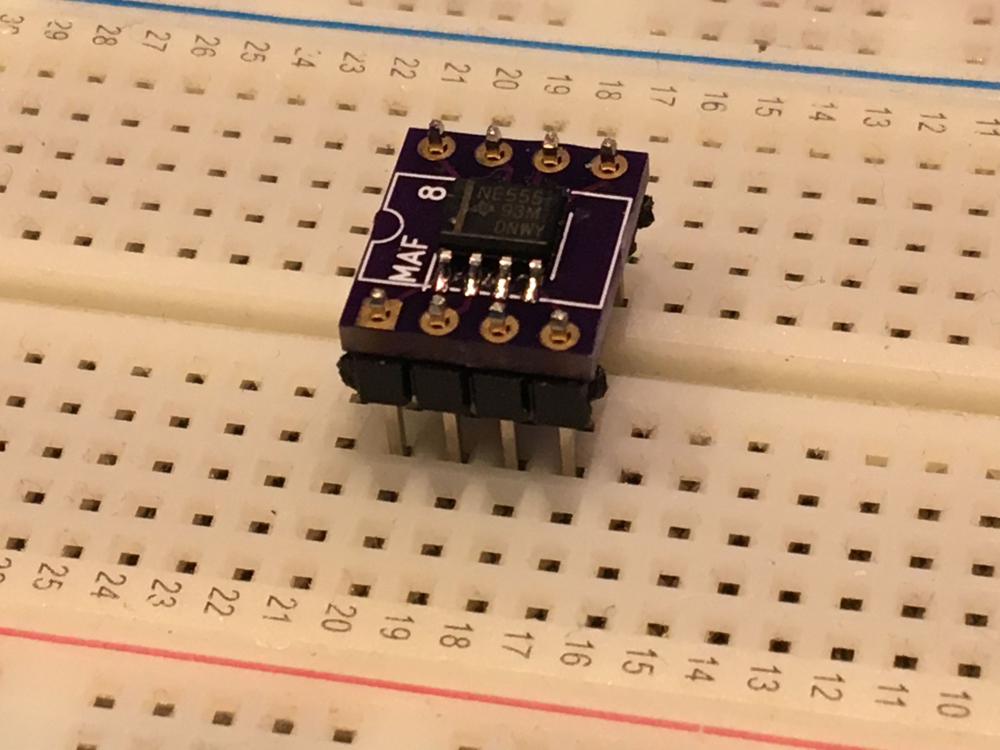

> But do not solder with a lot of heat on the breadboard, it migh melt the breadboard socket guides.

* Solder the pins all the way.

And then the final result:

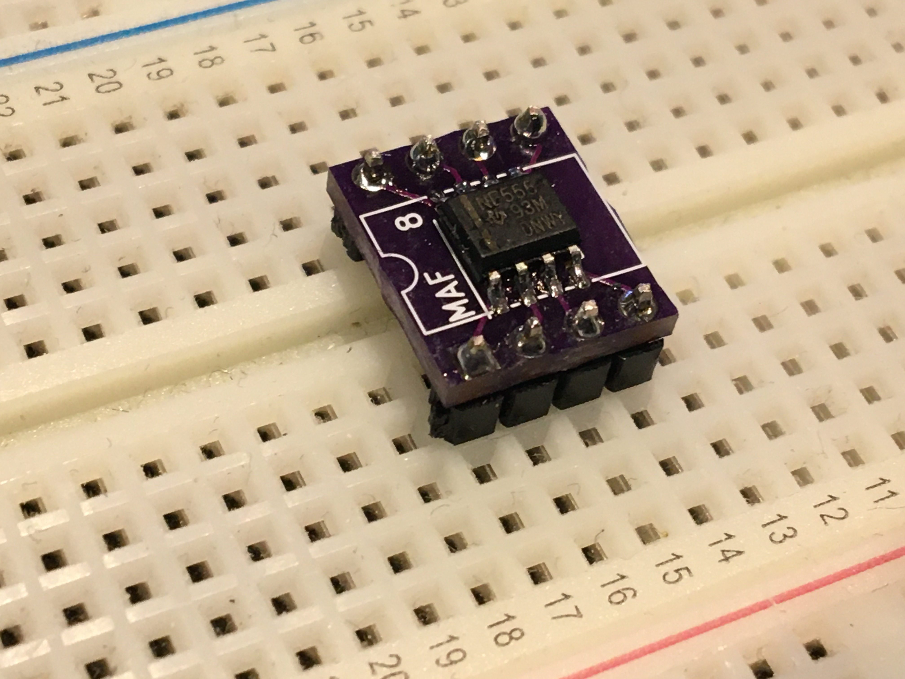

It is the similar idea for the other packages, just with more or different pins really.