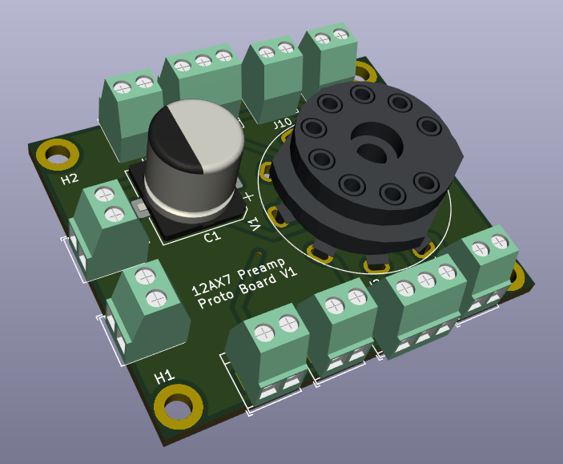
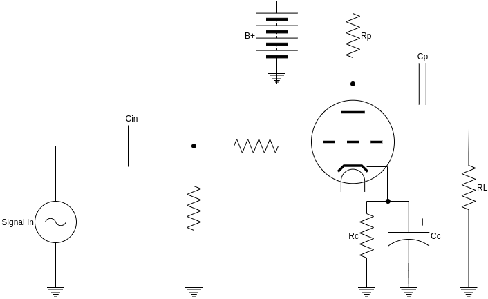
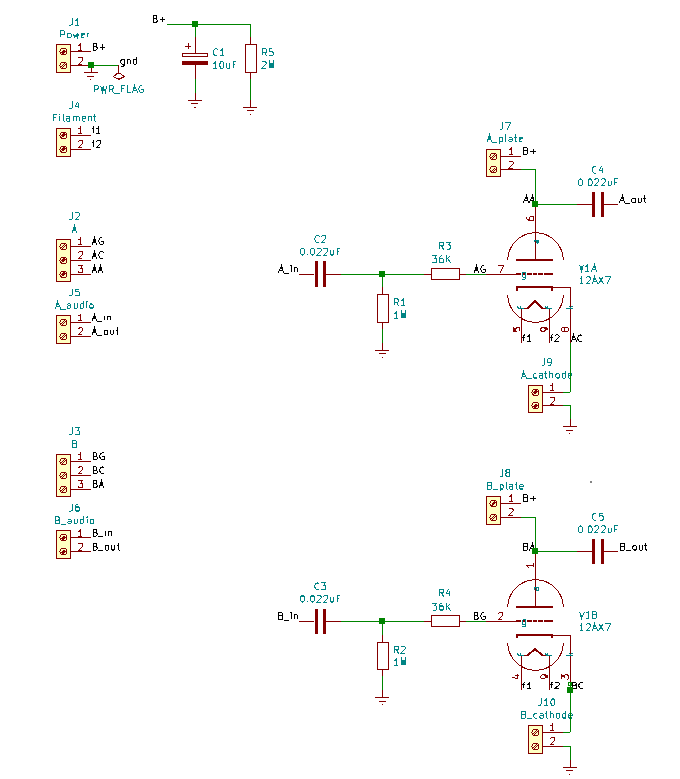
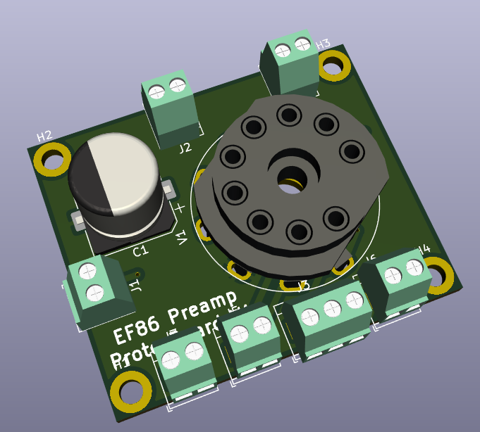
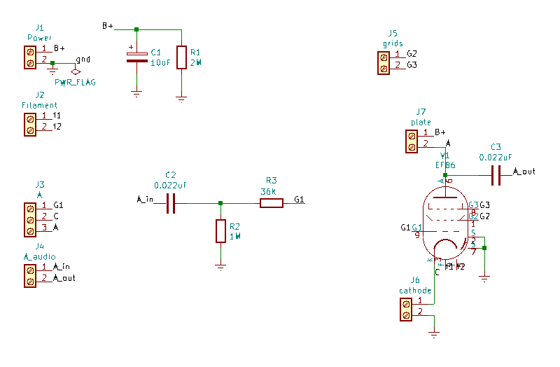

# A Small PCB for prototyping Tube preamp circuits

> Vacuum tubes work on high voltages. These are dangerous and can kill you.
>
> You must know what you are doing.
>
> By using this, you do so at your own risk.
>
Small Vacuum tube triodes are easy to work with. But at the same time they can very hard to set up on a breadboad.

In a typical tube preamplifier circuit based on the 12AX7 family of vacuum tubes, as in a guitar or audio amplifier you will have:

* A filament power supply, usually 6.3 VAC
* A B+ power to the plate of the tube, usually 150 VDC to 350 VDC
* A high impedance, low amplitude AC signal to the grid.
* A a medium-high impediance, higher amplitude AC output signal off the plate.

The design, explaination of operation of vacuum tubes for audio amplification is beyond the scoope of this project.

But typically there are a few "boiler plate" things that need to be set up.

* An input bypass capacitor. Usually 0.022 to 0.1uF
* A grid bypass resistor. Usually 1M ohms.
* A grid leak resistor. Usually 36K ohms.
* A plate load resistor. Usually 100K ohms.
* A plate bypass capacitor. Usually 0.022uF to 0.1uF
* The output load. Which can be a potentiometer, or resister divider to the next stage.
* Power supply decoupling. We usually want a local small value capacitor near the tube plate input to help smooth out transients on the supply voltage.
* A filament supply.

The interesting parts that we want to adjust are the

* Plate load resistor.
* Cathode bypass resistor.
* Cathode bypass capacitor.

By changing these we can create a cathode follower. Sometimes we want to connect a transfomer as the output as well.

## 12AX7 Proto Board

I wanted to create a small PCB that would let me conveniently attach wires to it using screw terminal.

And then have enough screw terminals that I can get to the raw elements of the tube itself.

> Note the 12AX7 is a dual triode. So there are an "A" and a "B" element for which we have each:
>
>* cathode
>* grid
>* anode

And then I wanted to be able to have screw terminals to attach the decoupled/bypassed audio input and outputs to signal generator and the next preamplifier stage in the circuit.

And then screw terminals to connect the parts that I want to change, mainly:

* The plate load resistor
* The cathode bypass resistor (and capacitor).

I think with this apporach I can selectively not populate parts on the PCB. Or change values that are populated where.

## Resources

* The tube socket here is the Belton VT9-PT
* [The 12AX7 datasheet](https://frank.pocnet.net/sheets/137/1/12AX7.pdf)

## EF86 Proto Board

In a similar line of thought, but for the EF86 pentode tube.

This is a single low signal pentode. It has higher gain and different characteristcs than the 12AX7 tube.

It is a single pentode in the envelope.

Again going for a small board to hold the tube in a socket, and have some screw terminals to attach wires, and some boiler plate decoupling capacitors.